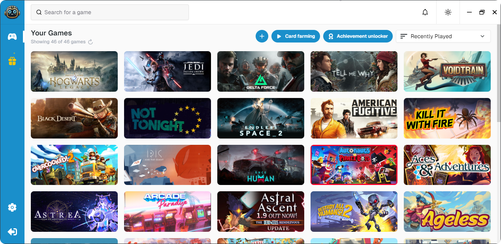

  
  <h1>Steam Game Idler</h1>
  
A lightweight, user-friendly tool for farming trading cards, unlocking achievements and boosting playtime for all games in your Steam library.

  
  
  
  

  
   
  <a href="https://steamgameidler.vercel.app/gallery">view more examples</a>

# Installation
1. Download the `.msi` installer from the [latest release](https://github.com/zevnda/steam-game-idler/releases/latest) page
2. Run the `.msi` installer and follow the steps of the installation guide
3. Run the installed `.exe`

# Build It Yourself
Follow the steps at [build it yourself](https://steamgameidler.vercel.app/build-it-yourself)

# Features
* **Card Farming**: Farm trading cards that can be sold for a profit, or to craft badges
* **Achievement Unlocker**: Automatically unlock achievements with human-like settings
* **Playtime Booster**: Boost any game's total playtime by manually idling them
* **Achievement Manager**: Manually unlock and lock any achievement for any game
* **Auto Game Idler**: Automatically idle chosen games when SGI launches
* **Fully Open Source**: So you know what you are downloading and running is safe to use
* **Actively Maintained**: New features and bug fixes are being rolled out frequently

# Usage
Check the [official docs](https://steamgameidler.vercel.app/) for an in-depth guide

# License
All versions of SGI are licensed under the **[GPL-3.0 License](./LICENSE)**
