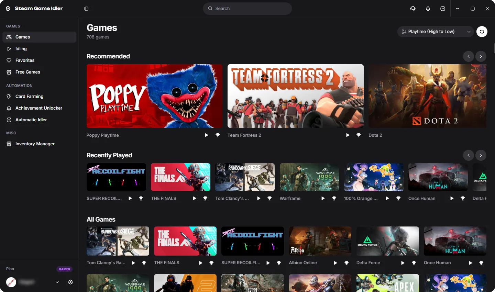

<h1>Steam Game Idler</h1>

Steam Game Idler (SGI) is a Steam automation tool for farming trading cards, managing achievements, and boosting playtime across all games in your Steam library.

Full **Windows** and **Linux** support. No local Steam client required.

See how it stacks up against other software, such as **[ArchiSteamFarm](https://steamgameidler.com/alternatives/archisteamfarm)**, **[Steam Achievement Manager](https://steamgameidler.com/alternatives/steam-achievement-manager)**, and **[Idle Master](https://steamgameidler.com/alternatives/idle-master)**.

[![Downloads][downloads]](https://github.com/zevnda/steam-game-idler/releases)
[![Release][release]](https://github.com/zevnda/steam-game-idler/releases/latest)
![Build][build]
[![Discord][discord]](https://discord.com/invite/5kY2ZbVnZ8)

 

# Installation

### Windows
1. Download the `setup.exe` installer from the **[releases page](https://github.com/zevnda/steam-game-idler/releases/latest)**
2. Run the installer and follow the steps

### Linux
3. Download the `.deb`, `.rpm` or `.AppImage` from the **[releases page](https://github.com/zevnda/steam-game-idler/releases/latest)**
4. See the **[linux install guide](https://steamgameidler.com/docs/get-started/install#linux)** for the full steps

Or if you prefer, you can **[build it yourself](https://steamgameidler.com/docs/get-started/build-it-yourself)** on either platform.

# Features
Refer to the **[documentation](https://steamgameidler.com/docs/)** for a detailed guide on each feature

* **[Multi-Account Support](https://steamgameidler.com/docs/get-started/multi-account)**: Easily manage multiple Steam accounts at the same time
* **[Card Farming](https://steamgameidler.com/docs/features/card-farming)**: Farm trading cards to sell for a profit or use in badge crafting
* **[Achievement Unlocker](https://steamgameidler.com/docs/features/achievement-unlocker)**: Unlock achievements automatically with human-like behavior
* **[Achievement Manager](https://steamgameidler.com/docs/features/achievement-manager)**: Manually unlock or lock any achievement for any game
* **[Inventory Manager](https://steamgameidler.com/docs/features/inventory-manager)**: Easily sell your inventory items on the Steam marketplace
* **[Playtime Booster](https://steamgameidler.com/docs/features/playtime-booster)**: Increase a game's total playtime by idling it manually
* **[Automatic Idler](https://steamgameidler.com/docs/features/auto-idler)**: Automatically idle chosen games when SGI launches
* **[Task Scheduling](https://steamgameidler.com/docs/features/task-scheduling)**: When one feature finishes, automatically start the next
* **[Free Game Alerts](https://steamgameidler.com/docs/features/free-games)**: Get notified when there are free Steam games to claim
* **[Sign In Methods](https://steamgameidler.com/docs/get-started/how-to-sign-in)**: Choose exactly how you want to sign in
* **Public Source Code**: Rest assured that what you're downloading and running is safe
* **Actively Maintained**: Regular updates with new features and bug fixes

# Supported Languages
Help contribute to this project by adding new translations or improving existing ones. **[Read more here](https://github.com/zevnda/steam-game-idler/discussions/148)**

# License
Copyright © 2024-2026 zevnda — **[Elastic-2.0 License](./LICENSE)**

[downloads]: https://img.shields.io/badge/dynamic/json?url=https%3A%2F%2Fapibase.vercel.app%2Fapi%2Fgh-downloads%3Fuser%3Dzevnda%26repo%3Dsteam-game-idler%26full%3Dfalse&query=results.grandTotal&style=flat-square&color=%23a82869&label=Downloads
[release]: https://img.shields.io/github/v/release/zevnda/steam-game-idler?style=flat-square&color=%232d6acc&label=Version
[build]: https://img.shields.io/github/actions/workflow/status/zevnda/steam-game-idler/release.yml?style=flat-square&color=%2313a135&label=Build
[discord]: https://img.shields.io/discord/1445588897076871277?label=Discord&style=flat-square&color=%236577e6

