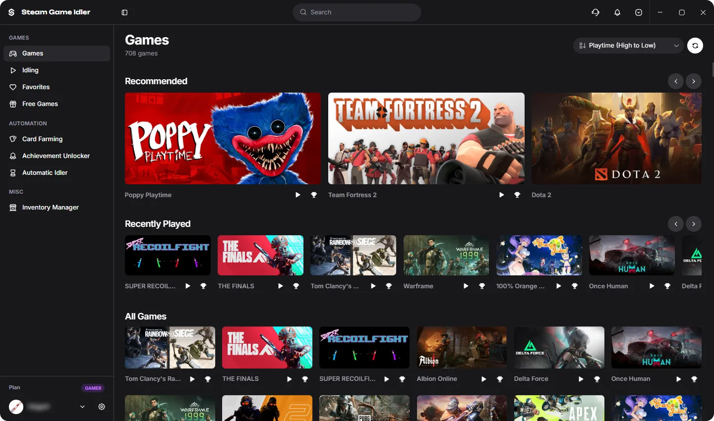

<h1>Steam Game Idler</h1>

Steam Game Idler (SGI) is a Steam automation tool for farming trading cards, managing achievements, and boosting playtime across all games in your Steam library.

Full **Windows** and **Linux** support. No local Steam client required.

See how it stacks up against other software, such as **[ArchiSteamFarm](https://steamgameidler.com/alternatives/archisteamfarm)**, **[Steam Achievement Manager](https://steamgameidler.com/alternatives/steam-achievement-manager)**, and **[Idle Master](https://steamgameidler.com/alternatives/idle-master)**.

[![Downloads][downloads]](https://github.com/zevnda/steam-game-idler/releases)
[![Release][release]](https://github.com/zevnda/steam-game-idler/releases/latest)
![Build][build]
[![Discord][discord]](https://discord.com/invite/5kY2ZbVnZ8)

[![Windows][windows]](https://github.com/zevnda/steam-game-idler/releases/latest)
[![Linux][linux]](https://github.com/zevnda/steam-game-idler/releases/latest)

 

# Installation

1. Download the latest release for your OS from the **[releases page](https://github.com/zevnda/steam-game-idler/releases/latest)** or the **[website](https://steamgameidler.com/download)**
    * **Windows (installer)**: Run the installer and follow the steps
    * **Windows (portable)**: Extract the contents of the `.zip` file and run `Steam Game Idler.exe`
    * **Linux**: See the **[Linux install guide](https://steamgameidler.com/docs/get-started/install#linux)** for the full steps
2. Choose between **[Steam Sign-in](https://steamgameidler.com/docs/get-started/how-to-sign-in#steam-sign-in)** or **[Legacy Sign-in](https://steamgameidler.com/docs/get-started/how-to-sign-in#legacy-sign-in)** mode
3. Start idling!

Or if you prefer, you can **[build it yourself](https://steamgameidler.com/docs/get-started/build-it-yourself)** on either platform.

# Features
Refer to the **[documentation](https://steamgameidler.com/docs/)** for a detailed guide on all features and settings

* **[Multi-Account Support](https://steamgameidler.com/docs/get-started/multi-account)**: Easily manage all features for multiple Steam accounts at the same time
* **[Card Farming](https://steamgameidler.com/docs/features/card-farming)**: Farm trading cards to sell for a profit or use in badge crafting
  * **[Two-phase farming engine](https://steamgameidler.com/docs/features/card-farming/how-it-works)**: Automatically optimizes farming to ensure cards drop as fast as possible
  * **[Skip refundable games](https://steamgameidler.com/docs/settings/card-farming#skip-refundable-games-steam-sign-in-only)**: Avoid farming games still inside Steam's refund window
  * **[Farm multiple games](https://steamgameidler.com/docs/settings/card-farming#farm-multiple-games-at-once)**: Farm up to 32 games at the same time
  * **[Blacklist games](https://steamgameidler.com/docs/features/card-farming/blacklisting-games)**: Permanently exclude certain games from card farming
  * **[Whitelist games](https://steamgameidler.com/docs/features/card-farming#farm-specific-games-only)**: Restrict farming to only a chosen list of games
  * **[Auto-farm cards](https://steamgameidler.com/docs/settings/card-farming#automatically-farm-cards)**: Automatically starts farming in the background with no manual trigger needed
* **[Achievement Unlocker](https://steamgameidler.com/docs/features/achievement-unlocker)**: Unlock achievements automatically with human-like behavior
  * **[Import achievement timings](https://steamgameidler.com/docs/features/achievement-unlocker/import-timings)**: Copy another Steam user's exact unlock order and delays
  * **[Custom unlock order & delay](https://steamgameidler.com/docs/features/achievement-unlocker/custom-order-and-unlock-delay)**: Reorder achievements, skip specific ones, and set a custom delay between each unlock
  * **[Randomized unlock intervals](https://steamgameidler.com/docs/settings/achievement-unlocker#unlock-interval)**: Set a min/max delay range so unlocks don't happen at fixed intervals
  * **[Scheduled unlocking](https://steamgameidler.com/docs/settings/achievement-unlocker#only-unlock-during-a-schedule)**: Only unlock achievements during a set time window
  * **[Unlock multiple games](https://steamgameidler.com/docs/settings/achievement-unlocker#run-multiple-games-at-once)**: Run up to 32 games at the same time
  * **[Idle while unlocking](https://steamgameidler.com/docs/settings/achievement-unlocker#idle-while-unlocking)**: Automatically idle a game for playtime while its achievements unlock
* **[Achievement Manager](https://steamgameidler.com/docs/features/achievement-manager)**: Manually unlock or lock any achievement for any game
  * **[Full stats editor](https://steamgameidler.com/docs/features/achievement-manager#statistics)**: View and edit a game's numeric statistics, not just its achievements
  * **[Special flags handling](https://steamgameidler.com/docs/features/achievement-manager/special-flags)**: Clearly see which achievements or stats are Protected, IncrementOnly, or Hidden and can't be freely changed
  * **[Bulk management](https://steamgameidler.com/docs/features/achievement-manager#achievements)**: Set a mix of unlocks and locks across multiple achievements, then apply them all in one go
* **[Inventory Manager](https://steamgameidler.com/docs/features/inventory-manager)**: Easily sell your inventory items on the Steam marketplace
  * **[Sell duplicates](https://steamgameidler.com/docs/features/inventory-manager)**: One click lists every duplicate item in your inventory, leaving one copy behind
  * **[Auto-pricing](https://steamgameidler.com/docs/features/inventory-manager/pricing-details)**: Automatically prices items from live highest buy or lowest sell order data, with min/max guardrails
  * **[Bulk-remove listings](https://steamgameidler.com/docs/features/inventory-manager#removing-listings)**: Cancel every active market listing in one go
  * **[Fee-aware pricing](https://steamgameidler.com/docs/features/inventory-manager/marketplace-fees)**: Listing prices automatically account for Steam's marketplace fees
* **[Playtime Booster](https://steamgameidler.com/docs/features/playtime-booster)**: Increase a game's total playtime by idling it manually
* **[Automatic Idler](https://steamgameidler.com/docs/features/auto-idler)**: Automatically idle chosen games when SGI is launched
* **[Task Scheduling](https://steamgameidler.com/docs/features/task-scheduling)**: When one feature finishes, automatically start another one
* **[Free Game Alerts](https://steamgameidler.com/docs/features/free-games)**: Get notified when there are free Steam games to claim
  * **[Auto-redeem](https://steamgameidler.com/docs/features/free-games#automated-redemption)**: Automatically claim free games for any signed-in account
* **[Favorites](https://steamgameidler.com/docs/features/favorites)**: Save your favorite games for quick access
* **[Manually Add Games](https://steamgameidler.com/docs/features/manual-add)**: Add any games you own that have since been removed from the Steam store
* **[Customization](https://steamgameidler.com/docs/settings/customization)**: Customize the app with 8 built-in themes, 10+ unique fonts, and custom background images
  * **[Custom idling status](https://steamgameidler.com/docs/settings/general#custom-status-while-idling-steam-sign-in-only--pro-gamer-tier)**: Replace the default "Playing game" status with your own custom text while idling
  * **[Per-account online status](https://steamgameidler.com/docs/settings/general#online-status-steam-sign-in-only)**: Set your Steam status to Online, Away, Invisible, and more, per account
* **[Multiple Sign-In Methods](https://steamgameidler.com/docs/get-started/how-to-sign-in)**: Choose exactly how you want to sign in
  * **[Local Steam accounts](https://steamgameidler.com/docs/get-started/how-to-sign-in#legacy-sign-in)**: Sign in with an account already logged in to your local Steam client, no username/password needed
  * **[QR code scanning](https://steamgameidler.com/docs/get-started/how-to-sign-in#steam-sign-in)**: Scan a QR code with your Steam mobile app, no username/password needed
  * **[Username and password](https://steamgameidler.com/docs/get-started/how-to-sign-in#steam-sign-in)**: Use your username/password as you would on the Steam client
* **Public Source Code**: Rest assured that what you're downloading and running is safe
* **Actively Maintained**: Regular updates with new features and bug fixes

# Supported Languages
Help contribute to this project by adding new translations or improving existing ones. **[Read more here](https://github.com/zevnda/steam-game-idler/discussions/148)**

| Language             | Flag | Language | Flag | Language | Flag |
| -------------------- | ---- | -------- | ---- | -------- | ---- |
| Chinese (Simplified) | 🇨🇳    | English  | 🇬🇧    | French   | 🇫🇷    |
| German               | 🇩🇪    | Italian  | 🇮🇹    | Portuguese (Brazil) | 🇧🇷 |
| Russian              | 🇷🇺    | Spanish  | 🇪🇸    | Turkish  | 🇹🇷    |

# License
Copyright © 2024-2026 zevnda — **[Elastic-2.0 License](./LICENSE)**

[downloads]: https://img.shields.io/badge/dynamic/json?url=https%3A%2F%2Fapibase.vercel.app%2Fapi%2Fgh-downloads%3Fuser%3Dzevnda%26repo%3Dsteam-game-idler%26full%3Dfalse&query=results.grandTotal&style=flat-square&color=%23a82869&label=Downloads
[release]: https://img.shields.io/github/v/release/zevnda/steam-game-idler?style=flat-square&color=%232d6acc&label=Version
[build]: https://img.shields.io/github/actions/workflow/status/zevnda/steam-game-idler/release.yml?style=flat-square&color=%2313a135&label=Build
[discord]: https://img.shields.io/discord/1445588897076871277?label=Discord&style=flat-square&color=%236577e6
[windows]: https://custom-icon-badges.demolab.com/badge/Windows-0078D6?logo=windows11&logoColor=white&style=flat-square
[linux]: https://img.shields.io/badge/Linux-FCC624?logo=linux&logoColor=black&style=flat-square
