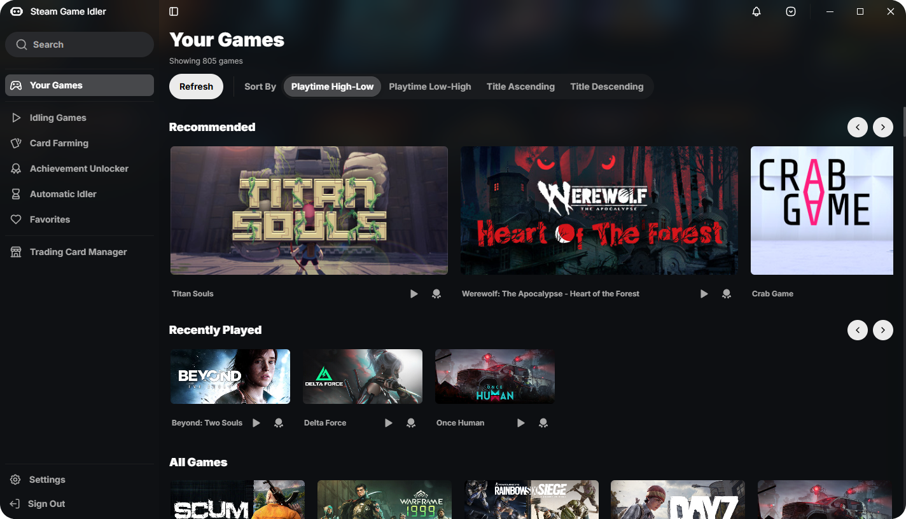

<h1>Steam Game Idler</h1>

A lightweight, user-friendly tool for farming trading cards, unlocking achievements and boosting playtime for all games in your Steam library.

 
<a href="https://steamgameidler.vercel.app/gallery">view more examples</a>

# Installation
1. Download the `setup.exe` installer from the **[releases page](https://github.com/zevnda/steam-game-idler/releases/latest)**
2. Run the installer and follow the steps

# Build It Yourself
Follow the **[build it yourself](https://steamgameidler.vercel.app/get-started/build-it-yourself)** guide

# Features
Check the **[documentation](https://steamgameidler.vercel.app/)** for an in-depth guide for each feature

* **[Card Farming](https://steamgameidler.vercel.app/features/card-farming)**: Farm trading cards that can be sold for a profit, or to craft badges
* **[Achievement Unlocker](https://steamgameidler.vercel.app/features/achievement-unlocker)**: Automatically unlock achievements with human-like settings
* **[Playtime Booster](https://steamgameidler.vercel.app/features/playtime-booster)**: Boost any game's total playtime by manually idling them
* **[Achievement Manager](https://steamgameidler.vercel.app/features/achievement-manager)**: Manually unlock and lock any achievement for any game
* **[Auto Game Idler](https://steamgameidler.vercel.app/features/auto-idler)**: Automatically idle chosen games when SGI launches
* **Fully Open Source**: So you know what you are downloading and running is safe to use
* **Actively Maintained**: New features and bug fixes are being rolled out frequently

# Help Translate SGI
Contribute to SGI by translating the app into your language or improving existing translations. **[Read more here](https://github.com/zevnda/steam-game-idler/discussions/148)**

| Complete | Language            | Contributors                             | File                                                                                                            |
| -------- | ------------------- | ---------------------------------------- | --------------------------------------------------------------------------------------------------------------- |
| 100%     | English             | [@zevnda](https://github.com/zevnda)     | [en](https://raw.githubusercontent.com/zevnda/steam-game-idler/main/src/i18n/locales/en/translation.json)       |
| 100%     | German              | ~                                        | [de](https://raw.githubusercontent.com/zevnda/steam-game-idler/main/src/i18n/locales/de/translation.json)       |
| 100%     | Italian             | [@Maniots](https://github.com/Maniots)   | [it](https://raw.githubusercontent.com/zevnda/steam-game-idler/main/src/i18n/locales/it/translation.json)       |
| 100%     | Portuguese (Brazil) | [@Qjeh](https://github.com/Qjeh)         | [pt-BR](https://raw.githubusercontent.com/zevnda/steam-game-idler/main/src/i18n/locales/pt-BR/translation.json) |
| 100%     | Russian             | [@Jesewe](https://github.com/Jesewe)     | [ru](https://raw.githubusercontent.com/zevnda/steam-game-idler/main/src/i18n/locales/ru/translation.json)       |
| 100%     | Ukrainian           | [@Bl0ck154](https://github.com/Bl0ck154) | [uk](https://raw.githubusercontent.com/zevnda/steam-game-idler/main/src/i18n/locales/uk/translation.json)       |

# License
All versions of SGI are licensed under the **[GPL-3.0 License](./LICENSE)**
